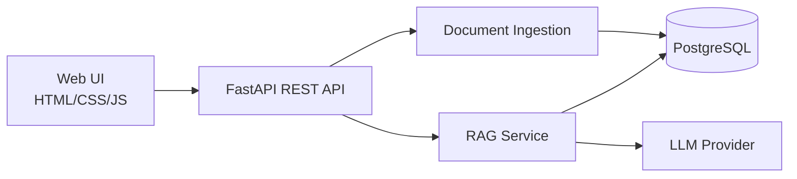

AI Financial Research & Strategy Assistant
A portfolio-ready full-stack AI application for financial research, document question-answering, and context-aware report generation.
Highlights
FastAPI backend with clean API structure, request validation, and exception handling
RAG-ready architecture for grounded answers over uploaded financial documents
PostgreSQL for persistent document and research-session metadata
LLM integration layer with an optional OpenAI-compatible provider
Responsive HTML/CSS/JavaScript frontend
Docker + Docker Compose for reproducible local development
Pytest health/API test coverage
Clear separation of API, services, data access, and presentation layers
Architecture

Tech Stack
Python
FastAPI
PostgreSQL
SQLAlchemy
Pydantic
OpenAI-compatible LLM API
HTML / CSS / JavaScript
Docker
Pytest
Project Structure
```text
ai-financial-research-assistant/
├── app/
│   ├── main.py
│   ├── config.py
│   ├── db.py
│   ├── models.py
│   ├── schemas.py
│   ├── services/
│   │   ├── llm.py
│   │   └── rag.py
│   ├── static/
│   │   └── app.js
│   └── templates/
│       └── index.html
├── docs/
│   └── architecture.md
├── tests/
│   └── test_health.py
├── .env.example
├── .gitignore
├── Dockerfile
├── docker-compose.yml
├── requirements.txt
└── README.md
```
Quick Start
1. Clone and create an environment
```bash
git clone https://github.com/<your-username>/ai-financial-research-assistant.git
cd ai-financial-research-assistant
python -m venv .venv
```
Windows:
```bash
.venv\Scripts\activate
```
macOS/Linux:
```bash
source .venv/bin/activate
```
2. Install dependencies
```bash
pip install -r requirements.txt
```
3. Configure environment variables
```bash
copy .env.example .env
```
Set the database URL and optional LLM API key in `.env`.
4. Start PostgreSQL
Using Docker:
```bash
docker compose up -d db
```
5. Run the API
```bash
uvicorn app.main:app --reload
```
Open: `http://127.0.0.1:8000`
API docs: `http://127.0.0.1:8000/docs`
API Endpoints
Method	Endpoint	Purpose
GET	`/api/health`	Health check
POST	`/api/research`	Generate a grounded research response
GET	`/api/documents`	List stored research documents
Example Request
```json
POST /api/research
{
  "question": "What are the major risks discussed in the uploaded material?",
  "context": [
    "Revenue growth slowed in the second half.",
    "Input costs increased by 8%."
  ]
}
```
Engineering Notes
The repository intentionally keeps the LLM provider behind a small service boundary so the application can swap providers without changing API contracts. The RAG service accepts retrieved context explicitly, which makes evaluation and testing easier and helps reduce unsupported responses.
Roadmap
PDF/document ingestion
Embedding generation and vector search
Source citation in answers
Portfolio analytics tools
Research report export
Authentication and role-based access
CI with linting and tests
Portfolio Positioning
This project demonstrates practical software-engineering skills across backend APIs, databases, validation, error handling, Git workflows, frontend integration, and AI/RAG architecture.
